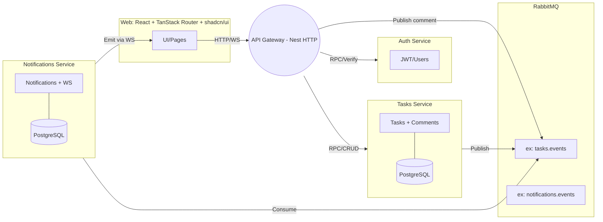

## Resposta do Desafio — Sistema de Gestão de Tarefas Colaborativo

Este documento apresenta minha proposta para o desafio: arquitetura, decisões técnicas, como executar, endpoints, eventos e um todo‑list claro das rotas e funcionalidades pendentes/concluídas.

---

### Arquitetura (visão geral)



---

### Decisões técnicas

- **Nest.js + TypeORM (PostgreSQL)**: padroniza repositórios, migrations e entidades.
- **RabbitMQ**: eventos assíncronos para criação/atualização/comentários de tarefas.
- **API Gateway**: único ponto HTTP/Swagger e rate limiting.
- **JWT centralizado no Auth Service**: emissão/validação via RPC.
- **WebSocket no Notifications Service**: entrega de eventos em tempo real.
- **Monorepo (Turborepo + pnpm)**: reuso de `packages` e configs compartilhadas.

---

### Como executar (Docker Compose)

Pré‑requisitos: Docker e Docker Compose, Node 20+, pnpm.

1. Instale dependências na raiz:
   - `pnpm install`
2. Suba os serviços:
   - `docker compose up -d --build`
3. Acesse:
   - API Gateway: `http://localhost:3001`
   - Swagger: `http://localhost:3001/api/docs` (quando habilitado)
   - RabbitMQ UI: `http://localhost:15672` (admin/admin)
   - Postgres: `localhost:5432` (postgres/password)

Observação: os `Dockerfile`s do frontend não estão presentes neste repositório; o foco desta entrega é o backend com microserviços e gateway.

---

### Serviços e portas (planejado)

- API Gateway (Nest HTTP): `3001`
- Auth Service (Nest microservice): `3002`
- Tasks Service (Nest microservice): `3003`
- Notifications Service (Nest microservice + WS): `3004`
- RabbitMQ (broker): `5672` e UI `15672`
- PostgreSQL: `5432`

---

### Endpoints HTTP (Gateway)

```
POST   /api/auth/register
POST   /api/auth/login
POST   /api/auth/refresh

GET    /api/tasks?page=&size=
POST   /api/tasks
GET    /api/tasks/:id
PUT    /api/tasks/:id
DELETE /api/tasks/:id

POST   /api/tasks/:id/comments
GET    /api/tasks/:id/comments?page=&size=
```

Campos principais de tarefa: título, descrição, prazo, prioridade (`LOW|MEDIUM|HIGH|URGENT`), status (`TODO|IN_PROGRESS|REVIEW|DONE`), atribuídos (múltiplos usuários).

---

### Eventos WebSocket (Notifications Service)

- `task:created` — nova tarefa criada
- `task:updated` — tarefa atualizada (inclui mudança de status/atribuições)
- `comment:new` — novo comentário adicionado

---

### Todo‑list — Rotas e Funcionalidades

Autenticação (API Gateway + Auth Service)

- [x] `POST /api/auth/register` — cadastrar usuário (hash com bcrypt/argon2)
- [x] `POST /api/auth/login` — autenticar e emitir `accessToken`/`refreshToken`
- [x] `POST /api/auth/refresh` — renovar `accessToken`
- [x] Guard JWT no Gateway protegendo rotas `/api/tasks*`
- [x] Rate limiting no Gateway (10 req/s)
- [ ] Swagger com esquemas (DTOs) e exemplos

Tarefas e Comentários (API Gateway + Tasks Service)

- [x] `GET /api/tasks` — paginação, filtros básicos (status, prioridade, busca)
- [x] `POST /api/tasks` — criar tarefa (publicar `task.created`)
- [x] `GET /api/tasks/:id` — detalhe da tarefa
- [x] `PUT /api/tasks/:id` — atualizar (publicar `task.updated`)
- [x] `DELETE /api/tasks/:id` — remover tarefa
- [x] `POST /api/tasks/:id/comments` — criar comentário (publicar `comment.new`)
- [x] `GET /api/tasks/:id/comments` — listar comentários com paginação
- [x] Entidades TypeORM: `Task`, `Comment`, `TaskUser`
- [x] Migrations TypeORM aplicadas no start
- [ ] Audit log simplificado (histórico de alterações)

Notificações & Tempo Real (Notifications Service)

- [x] Estrutura básica do serviço (controller + service)
- [x] Consumir eventos do RabbitMQ (criação, atualização, comentário)
- [ ] Persistir notificações por usuário
- [x] WebSocket: broadcast básico implementado
- [x] Eventos: `task:created`, `task:updated`, `comment:new`

Frontend

- [ ] Páginas: Login/Register, Lista de Tarefas, Detalhe (com comentários)
- [ ] Estado de auth (Context/Zustand), validação (`react-hook-form` + `zod`)
- [ ] UI com shadcn/ui + Tailwind (≥5 componentes)
- [ ] WebSocket para notificações em tempo real
- [ ] Loading/Error states (skeleton + toasts)

Infra/DevX

- [x] Docker Compose com serviços, Postgres e RabbitMQ
- [ ] Health checks/observabilidade (diferencial)
- [ ] Logs estruturados (Winston/Pino) (diferencial)
- [ ] Testes unitários de serviços críticos (diferencial)

Status atual do repositório

- [x] Monorepo organizado com `apps/` e `packages/`
- [x] Serviços completos (`api-gateway`, `auth-service`, `tasks-service`, `notifications-service`)
- [x] Integração completa com RabbitMQ (package compartilhado)
- [x] Implementação completa de DTOs/Guards (JWT Auth)
- [x] Implementação completa dos endpoints de autenticação e tarefas
- [x] CRUD completo de tarefas e comentários
- [x] WebSocket básico para notificações em tempo real
- [x] Rate limiting no Gateway
- [ ] Swagger/OpenAPI documentation
- [ ] Persistência de notificações por usuário
- [ ] Audit log de alterações

---

### Fluxos (alto nível)

Autenticação

1. `register` cria usuário e retorna tokens.
2. `login` retorna tokens após validação.
3. Gateway protege rotas e valida `accessToken`; `refresh` renova.

CRUD de Tarefas

1. Criação/atualização no Tasks Service via Gateway.
2. Publicação de eventos no RabbitMQ.
3. Notifications Service consome e envia via WebSocket aos interessados.

Comentários

1. Gateway recebe comentário; Tasks Service persiste.
2. Evento é publicado; Notifications entrega `comment:new` aos participantes.

---

### Como testar rapidamente

- Usar `client.http` na raiz com uma extensão REST Client (VS Code) ou `curl`/Postman.
- Conferir logs dos containers: `docker compose logs -f <service>`.
- Acompanhar filas no RabbitMQ UI (`http://localhost:15672`).

---

### Problemas conhecidos

- Falta a implementação do Swagger/OpenAPI documentation.
- Persistência de notificações por usuário não implementada.
- Frontend não incluso por enquanto.
- Audit log de alterações não implementado.

---

Obrigado pela avaliação! Qualquer dúvida, fico à disposição.
